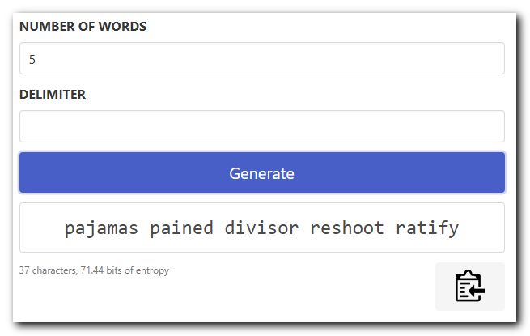

# Diceware Passphrase Generator

A simple, static diceware passphrase generator that uses `window.crypto.getRandomValues()` for cryptographically secure pseudo random numbers.

It can be run locally by opening `index.html` in your web browser. All assets are included in the repository so no network connection is required.

Hosted online at https://diceware.danhersam.com

# Usage

* Choose the number of words for the passphrase
* Choose the character(s) to use between each word in the passphrase
* Click the clipboard button to copy the passphrase to your clipboard
