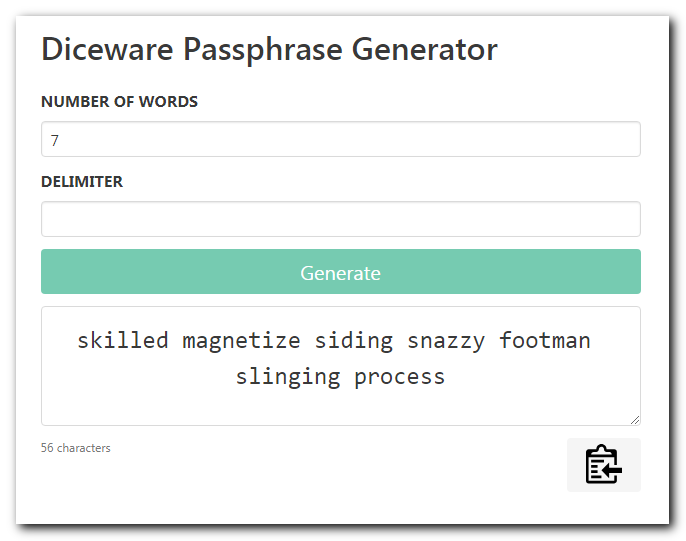

# Diceware Passphrase Generator

A simple, static diceware passphrase generator that uses `window.crypto.getRandomValues()` for cryptographically secure pseudo random numbers.

It can be run locally by opening `index.html` in your web browser. All assets are included in the repository so no network connection is required.

Hosted online at https://snapmagic.com/diceware/

# Usage

* Choose the number of characters in the password
* Enter the characters that can be used in the password
